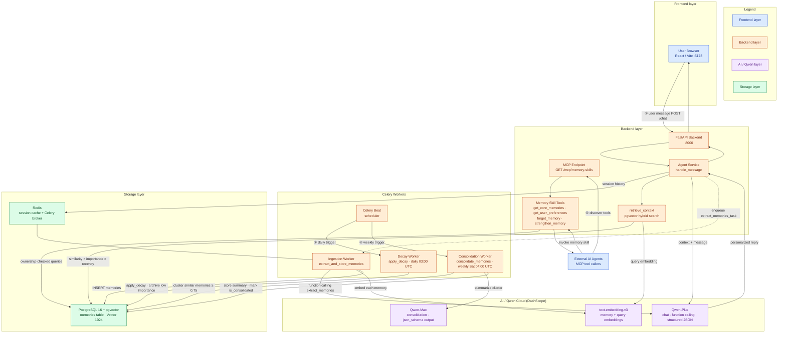

# Memoria — System Architecture (v1.1)

Memoria is a self-evolving personal AI with human-like memory. The upgraded
stack (Modules 1–3) adds **MCP memory skills** for external agents, a
**Qwen-Max consolidation engine**, and a **quantitative benchmark suite** that
demonstrates measurable recommendation improvement when memory is present.

## Architecture diagram

### Data flows (numbered in diagram)

| # | Flow | Path |
|---|------|------|
| ① | **Chat with memory** | User message → FastAPI → `retrieve_context` (pgvector similarity) → Qwen-Plus with packed context → personalized response |
| ② | **Memory ingestion** | Chat turn → Celery ingestion worker → Qwen-Plus function calling (`extract_memories`) → `text-embedding-v3` → store in PostgreSQL |
| ③ | **Daily decay** | Celery Beat (03:00 UTC) → `apply_decay` → exponential importance decay → soft-delete (`archived`) low-importance memories |
| ④ | **Weekly consolidation** | Celery Beat (Sat 04:00 UTC) → `consolidate_memories` → cluster by cosine similarity (≥ 0.75) → Qwen-Max summary → link originals via `parent_id` / `is_consolidated` |
| ⑤ | **MCP interoperability** | External agent → `GET /mcp/memory-skills` → invoke tool (`get_core_memories`, etc.) → ownership-checked DB query → JSON result |

## Why this architecture

Memoria separates **interactive latency** from **durable memory work**. Chat
requests stay on the FastAPI async path (sub-second retrieval + one Qwen-Plus
call), while ingestion, decay, and consolidation run in Celery workers so heavy
LLM and database operations never block the user. Redis holds ephemeral session
state; PostgreSQL with pgvector is the single source of truth for long-term
memory. This split scales horizontally: add API replicas for traffic and worker
replicas for backlog, without coupling user-facing response time to background
processing volume.

## Key design patterns

**pgvector hybrid retrieval** ranks candidates by cosine similarity multiplied
by importance and a recency decay factor, then greedily packs context under a
token budget—always prioritizing `core` memories first. **Celery background
jobs** decouple write-heavy pipelines (extraction, decay, consolidation) from
the request/response cycle and are scheduled declaratively via Celery Beat.
**MCP memory skills** (Module 1) expose four async tools—`get_core_memories`,
`get_user_preferences`, `forget_memory`, `strengthen_memory`—over a standard
HTTP catalog endpoint, letting external Qwen agents interoperate without
tight coupling to Memoria's chat API. **Structured JSON output** via
`call_qwen_structured()` enforces DashScope `json_schema` responses for
consolidation (`summary` + `key_themes`), reflection (`reflection` + `traits`),
and conflict detection (`contradiction` + `reason`), while ingestion continues
to use function calling. The **benchmark suite** (Module 3) provides
quantitative proof that memory-aware recommendations score higher on accuracy,
safety, and coherence than memory-less baselines.

## Memory lifecycle

1. **Capture** — after each chat turn, the ingestion worker calls Qwen-Plus
   function calling to extract structured memories (`core`, `episodic`,
   `semantic`, `procedural`).
2. **Embed** — each memory is vectorized with `text-embedding-v3` (1024 dims)
   and stored in the `memories` table alongside importance, decay rate, and
   metadata.
3. **Retrieve** — at query time, `retrieve_context` embeds the user message and
   returns the most relevant packed context for Qwen-Plus.
4. **Consolidate** — weekly, similar recent memories are clustered and
   summarized by Qwen-Max into a single semantic memory (structured JSON with
   `summary` and `key_themes`); originals are marked `is_consolidated` and
   linked via `parent_id`.
5. **Decay** — daily, non-core memories lose importance exponentially; those
   falling below the archive threshold are soft-deleted.

## Components reference

| Component | Role |
|-----------|------|
| `frontend/` | React/Vite dashboard — Chat (Markdown), Memory tab with stats cards + type chart |
| `backend/app/main.py` | FastAPI entrypoint — `/health`, `/chat`, `/mcp/memory-skills` |
| `backend/app/mcp/memory_skill.py` | MCP tool implementations for external agents |
| `backend/app/memory/consolidation.py` | Clustering + Qwen-Max structured summarization (`json_schema`) |
| `backend/app/memory/reflection.py` | Structured user reflection synthesis (`traits` in metadata) |
| `backend/app/memory/conflict_detection.py` | pgvector similarity + structured contradiction checks |
| `backend/app/core/dashscope_client.py` | DashScope helpers incl. `call_qwen_structured()` |
| `scripts/benchmark.py` | Quantitative with/without-memory benchmark (Module 3) |
| `infrastructure/acs_deployment.tf` | Alibaba Cloud IaC (ECS, ApsaraDB PostgreSQL, Redis) |

## Deployment

Infrastructure-as-code for Alibaba Cloud lives in
[`infrastructure/acs_deployment.tf`](../infrastructure/acs_deployment.tf); the
backend container image is defined by [`backend/Dockerfile`](../backend/Dockerfile).
