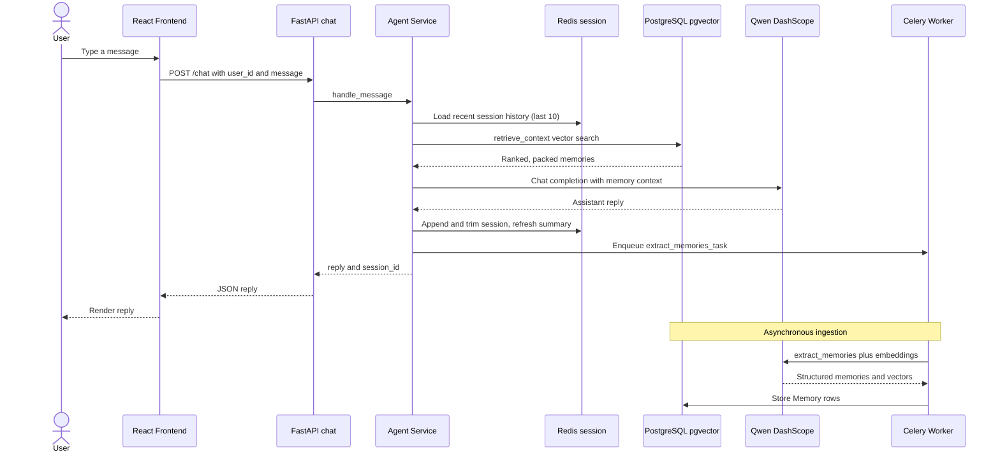
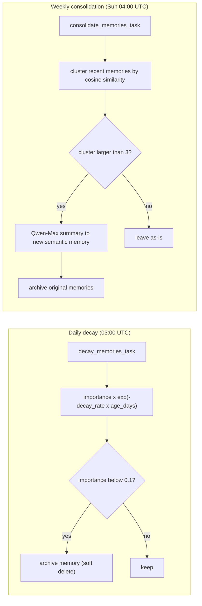

# Memoria — Architecture

Memoria is a modular, async FastAPI backend that gives an LLM agent human-like
memory: it **extracts**, **embeds**, **stores**, **retrieves**, **decays**, and
**consolidates** memories across sessions, powered by Qwen (DashScope) and
Alibaba Cloud data services.

## Chat request flow

## Scheduled memory maintenance (Celery Beat)

## Components

- **FastAPI backend** (`backend/app`) — async HTTP API. Exposes `GET /health`,
  `POST /chat`, and `GET/DELETE /api/memories` for the dashboard.
- **PostgreSQL + pgvector** — durable memory store. The `memories` table holds
  content, a `Vector(1024)` embedding, `importance`, `decay_rate`, timestamps,
  a self-referential `parent_id`, JSONB metadata, and an `archived` flag.
- **Redis** — short-term session state (rolling last-N messages) and rolling
  per-session summaries; also the Celery broker/result backend.
- **Celery + Celery Beat** — background ingestion (`extract_memories_task`) and
  scheduled maintenance (`decay_memories_task` daily, `consolidate_memories_task`
  weekly).
- **Qwen Cloud APIs (DashScope)** — `qwen-plus` for chat, `qwen-max` for
  consolidation summaries, and `text-embedding-v3` (1024-dim) for embeddings.
- **React frontend** (`frontend/`) — Vite dashboard with a Chat tab and a
  Memory tab (inspect + manually forget memories).

## Memory flow

1. **Extraction** — after each turn, `extract_memories_task` sends the exchange
   to Qwen with an `extract_memories` function/tool schema, yielding structured
   items (`content`, `type`, `importance`, `expires_in_hours`).
2. **Embedding** — each memory's content is embedded with `text-embedding-v3`
   (1024 dimensions, matching the pgvector column).
3. **Storage** — memories persist in PostgreSQL with a per-type `decay_rate`
   (`core` 0.0, `semantic` 0.01, `episodic` 0.02, `procedural` 0.005) and an
   optional `expires_at`.
4. **Retrieval** — `retrieve_context` embeds the query, ranks the top candidates
   by `cosine_similarity × importance × recency`, always includes `core`
   memories first, and greedily packs results under a token budget (tiktoken).
5. **Decay** — a daily job multiplies non-core importance by
   `exp(-decay_rate × age_days)` and archives anything below `0.1`.
6. **Consolidation** — a weekly job clusters similar recent memories (cosine
   similarity > 0.8); clusters larger than three are summarized by Qwen-Max into
   a single `semantic` memory, and the originals are archived.

## Deployment

Infrastructure-as-code for Alibaba Cloud (ECS + ApsaraDB for PostgreSQL +
ApsaraDB for Redis) lives in
[`infrastructure/acs_deployment.tf`](../infrastructure/acs_deployment.tf); the
backend container image is defined by [`backend/Dockerfile`](../backend/Dockerfile).
